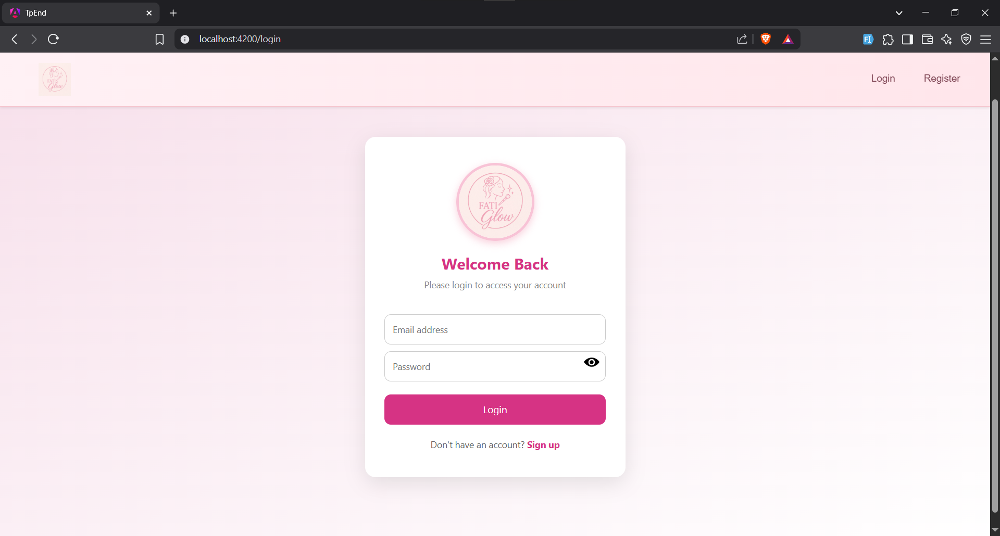
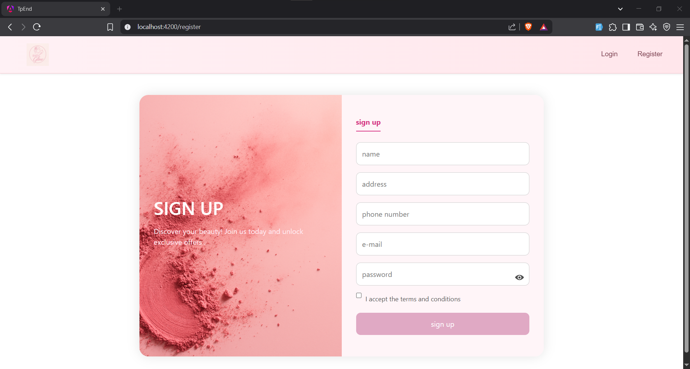
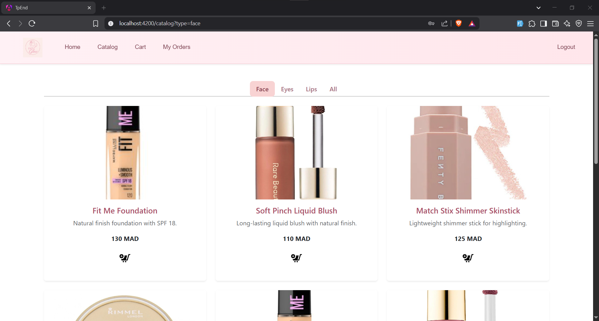
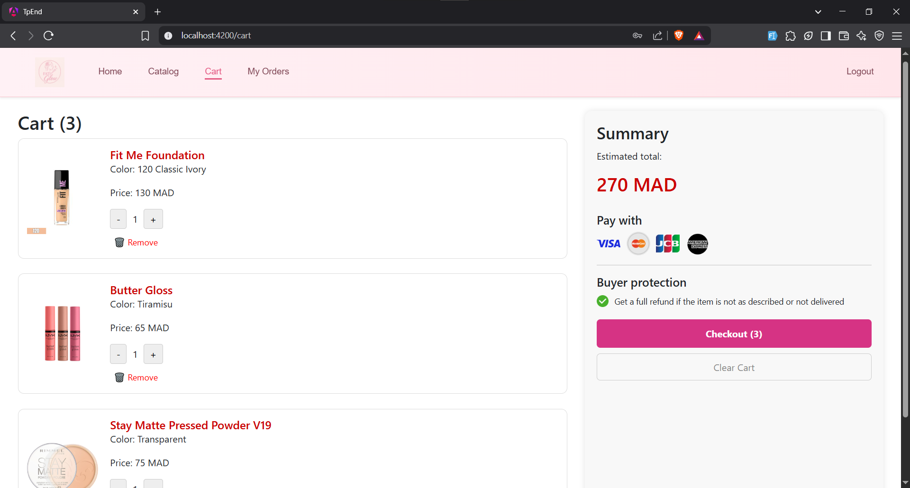
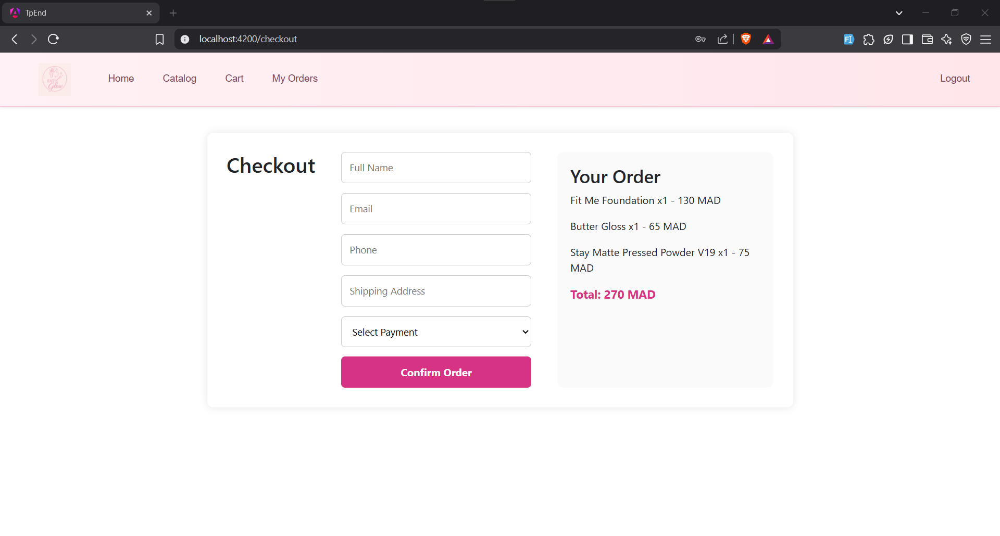
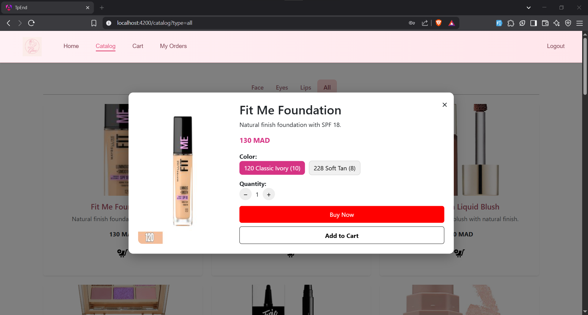
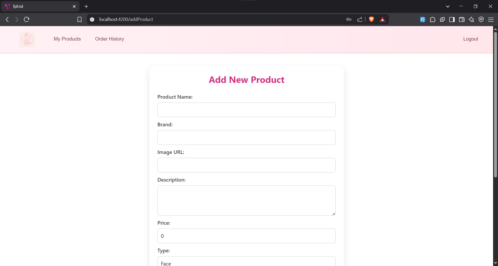
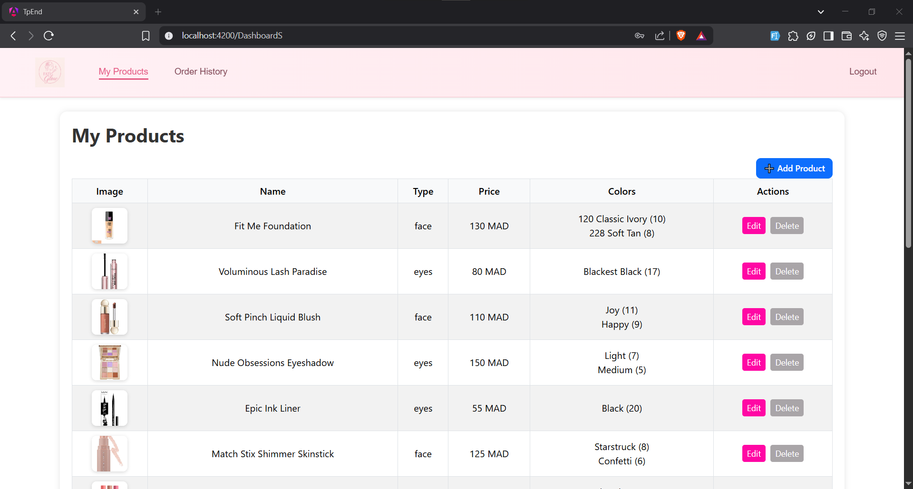
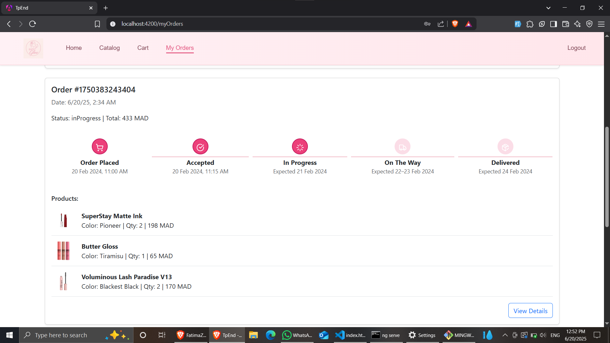
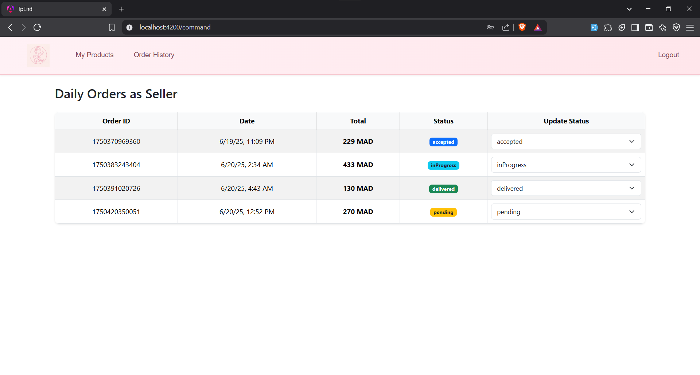

# 🛍️ Application E-Commerce Locale

## 👤 Réalisé par : **Fatima Zahrae El Ghiouan**

---

## 📘 Description du projet

Ce projet est une **application e-commerce locale** développée avec :

- **Frontend** : Angular (version standalone 19)
- **Backend** : Node.js + Express
- **Stockage** : LocalStorage (pas de base de données distante)

L'application permet :

- Aux **vendeurs** d'ajouter, modifier et supprimer leurs produits.
- Aux **acheteurs** de naviguer, passer des commandes et suivre leurs statuts.
- Une gestion des utilisateurs via `users.json`.

---

## 🚀 Comment exécuter le projet

### 📦 Étape 1 : Cloner le projet

```bash
git clone <url-du-projet>
cd tp_end
```

### ⚙️ Étape 2 : Installer les dépendances

#### 🔧 Côté Backend

```bash
cd backend
npm install
node index.js
```

📌 L’API va démarrer sur `http://localhost:3000`

#### 🔧 Côté Frontend

```bash
cd frontend
npm install
ng serve
```

📌 L’application va démarrer sur `http://localhost:4200`

---

## 🧱 Structure du projet

```text
tp_end/
├── backend/
│   ├── index.js         → Serveur Express
│   └── users.json       → Fichier des utilisateurs
│
├── caputer/             → Captures d’écran de l'application
│   ├── login.png
│   ├── register.png
│   ├── catalog.png
│   ├── cart.png
│   ├── checkout.png
│   ├── addProduct.png
│   ├── detailproduct.png
│   ├── myProducts.png
│   ├── myorders.png
│   ├── orderHistory.png
│   └── home.png
│
├── src/
│   ├── app/
│   │   ├── login/
│   │   ├── register/
│   │   ├── buyer/
│   │   ├── seller/
│   │   ├── checkout/
│   └── assets/
├── README.md
└── users.json
```

---

## 🎯 Fonctionnalités

- ✅ Authentification avec rôles (xari, bay3)
- ✅ Ajout / modification / suppression de produits (vendeur)
- ✅ Commande et suivi (acheteur)
- ✅ Sauvegarde dans `localStorage` (produits, commandes)
- ✅ i18n (optionnel avec `ngx-translate`)

---

## 🖼️ Captures d’écran

📂 Les images sont stockées dans le dossier `caputer/`

### 🏠 Page d’accueil


### 🔐 Connexion


### 📝 Inscription


### 🛍️ Catalogue


### 🛒 Panier


### 💳 Paiement / Checkout


### 📦 Détail produit


### ➕ Ajouter un produit (vendeur)


### 📁 Mes produits (vendeur)


### 📑 Mes commandes (acheteur)


### 🧾 Historique des commandes


---

## 📥 Dépendances utilisées

### Frontend

- Angular
- Bootstrap
- ngx-translate (optionnel pour i18n)

### Backend

- Express.js
- fs (pour lire/écrire `users.json`)
- cors (pour autoriser l'accès frontend)

---

## 🧠 Notes

- Ce projet est **sans base de données distante**
- Toute la logique est stockée côté frontend (localStorage)
- Le backend simule les routes `/login`, `/register`, `/products`

---

## ✅ À faire

- [ ] Ajouter une base de données réelle (MongoDB par exemple)
- [ ] Améliorer la gestion des erreurs
- [ ] Ajouter des tests unitaires